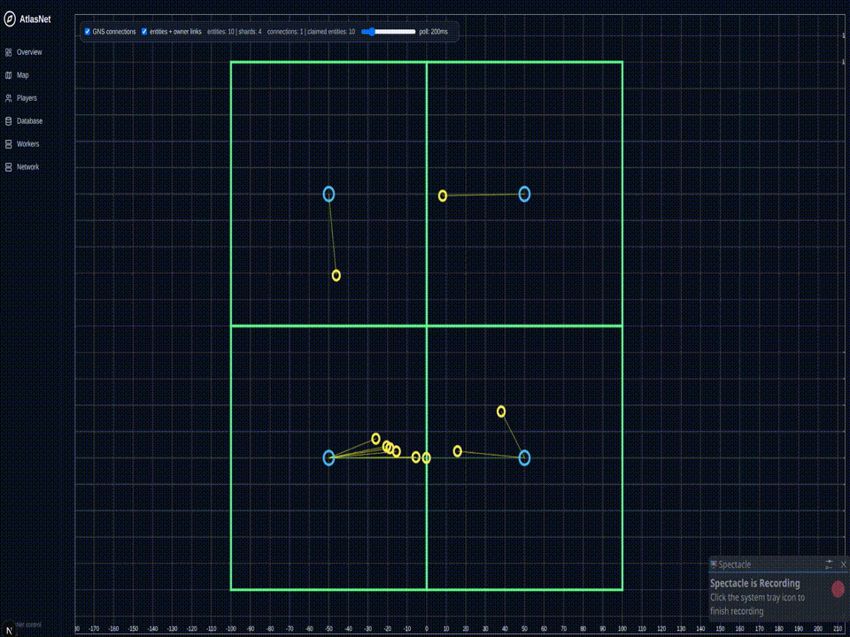
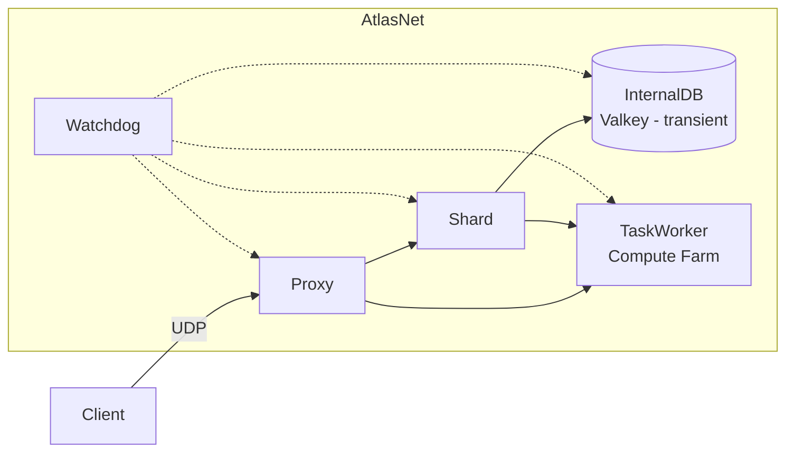

# 🗺️ AtlasNet


Scalable, universal distributed backend for Massively Multiplayer Onlines (MMO) games.

This project provides a distributed, containerized backend architecture designed for:

- High concurrency networking (TCP/UDP/WebSocket)
- Horizontal scaling
- Container orchestration
- Stateless microservices
- Production-grade deployment (Docker, Swarm, Kubernetes)

---

## ✨ Features

- Gateway Service (real-time networking)
- Authentication Service (JWT-based)
- Session / Match Service
- World / Game Logic Workers
- Redis cache support
- PostgreSQL persistence
- Message broker integration (NATS / Kafka optional)
- Prometheus metrics ready

---
## 🏗 Architecture Overview



## Repository layout

Matches the [Development tree](https://github.com/CamilaBasualdoCibils/AtlasNet/tree/Development):

| Path | Description |
|------|--------------|
| `AtlasNet/` | Core AtlasNet library and runtimes |
| `AtlasNet/lib/` | Libraries: Interlink, Database, Entity, Heuristic, InternalDB, Web, etc. (use only non-`exc` code) |
| `AtlasNet/runtime/` | Services: **watchdog**, **shard**, **proxy** (from `src/` only), **cartograph** (web) |
| `AtlasNet/API/` | Client and Server APIs (C++, Unity, Java optional) |
| `Examples/` | Sandbox client + server and other samples |
| `.devcontainer/` | Dev container (vcpkg, Docker-in-Docker, Node) |
| `.vscode/` | Editor config and tasks |
| `CMakeLists.txt` | Root CMake; adds AtlasNet and Examples |

## Requirements

¯\\_(ツ)_/¯


## Build
¯\\_(ツ)_/¯

---
## Development

### Server

A game server must implement our AtlasNetServer interface

### Client

A game client must implement our AtlasNetClient interface

---

## Running

###  Docker Swarm

Docker Stack example
```yml
version: "3.8"

services:
  WatchDog:
    image: watchdog
    networks: [AtlasNet]
    volumes:
      - /var/run/docker.sock:/var/run/docker.sock # REQUIRED
    deploy:
      labels:
        atlasnet.role: watchdog # REQUIRED
      placement:
          constraints:
            - 'node.role == manager'
      mode: replicated
      replicas: 1
      restart_policy:
        condition: on-failure

  Shard:
    image: shard:latest
    networks: [AtlasNet]
    deploy:
     labels:
        atlasnet.role: shard # REQUIRED
     resources:
        limits:
          cpus: "1.0"      # 1 core
          memory: 1G       # 1 GiB
     mode: replicated
     replicas: 0   # MUST BE 0
     restart_policy:
       condition: on-failure

  InternalDB:
    image: valkey/valkey:latest
    command: ["valkey-server", "--appendonly", "yes", "--port", "6379"]
    networks: [AtlasNet]
    ports:
      - target: 6379
        published: 6379
        protocol: tcp
        mode: ingress
    deploy:
      mode: replicated
      replicas: 1
      restart_policy:
        condition: on-failure
  Cartograph:
    image: cartograph
    networks: [AtlasNet]
    ports:
      - "3000:3000"   # Next.js default
      - "9229:9229"   # Node inspector
    deploy:
      placement:
          constraints:
            - 'node.role == manager'
      mode: replicated
      replicas: 1
      restart_policy:
        condition: on-failure
  Proxy:
    image: ${REGISTRY_ADDR_OPT}proxy:latest
    networks: [AtlasNet]
    ports:
      - target: 25568
        published: 2555
        protocol: tcp
        mode: ingress
      - target: 25568
        published: 2555
        protocol: udp
        mode: ingress
    deploy:
      mode: replicated
      replicas: 1
      restart_policy:
        condition: on-failure
#  BuiltInDB_Redis:
#    image: valkey/valkey:latest
#    command: ["valkey-server", "--appendonly", "yes", "--port", "2380"]
#    networks: [AtlasNet]
#    ports:
#      - target: 2380
#        published: 2380
#        protocol: tcp
#        mode: ingress
#      - target: 2380
#        published: 2380
#        protocol: udp
#        mode: ingress
#    deploy:
#      mode: replicated
#      replicas: 1
#      restart_policy:
#        condition: on-failure
#  BuiltInDB_PostGres:
#    image: postgres:16-alpine
#    command: ["postgres", "-c", "port=5432"]
#    environment:
#      POSTGRES_PASSWORD: postgres
#    volumes:
#      - pgdata:/var/lib/postgresql/data
#    networks: [AtlasNet]
volumes:
  pgdata:
    driver: local

networks:
  AtlasNet:
    name: AtlasNet
```
###  Kubernetes
---

## Dev container

The repo includes a **dev container** (`.devcontainer/`) with:

- vcpkg, Docker-in-Docker, Node.js (LTS)
- Extensions: CMake, Clangd, Docker, etc.

Use it in VS Code/Cursor with “Reopen in Container” to get a consistent build and run environment.


